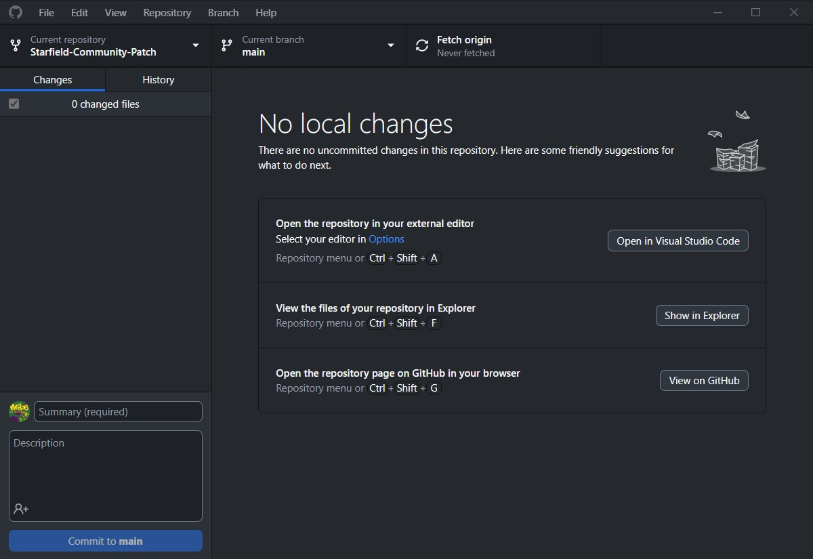

# Contributing Plugins Edits
One of the main ways users can contribute to SFCP is to provide their fixes in the form of a new ESM file which can be merged into the main project. Previously this was handled by the Core Team manually, but with advancements in Spriggit it is now possible for contributors to decode their plugin to YAML and create a merge request. 

# Requirements
To contribute plugin edits directly to the project you will need:
- A GitHub account
- A Nexus Mods account (optional, but recommended)
- [Mod Organizer 2]()
- [Git for Windows](https://git-scm.com/downloads)
- [GitHub Desktop](https://desktop.github.com/) or your preferred Git client
- [SpriggitCLI](https://github.com/Mutagen-Modding/Spriggit/releases)
- [SF1Edit](https://www.nexusmods.com/starfield/mods/239)
- [xTranslator](https://www.nexusmods.com/starfield/mods/313)
- Familiarity with xEdit, xTranslator and using command-line tools

For each fix you want to contribute, this process should be followed. 

# Setting up tools
To keep things simple, you should set up your tools as described below:

## SF1Edit
Download the latest version of SF1Edit from either Nexus Mods, GitHub or the xEdit Discord. Then open your install folder for Starfield.
- Create a new folder at `Starfield\Tools\SF1Edit` and extract the contents of the downloaded archive there. We'll keep this path generic so that it doesn't change when updating SF1Edit in future.
- Verify that the `SF1Edit64.exe` can be found at `Starfield\Tools\SF1Edit\SF1Edit64.exe` (you may need to move all the files up one level, depending on the source of the download)

## Spriggit
Download the latest version of SpriggitCLI from GitHub. Then open your install folder for Starfield.
- Create a new folder at `Starfield\Tools\Spriggit` and extract the contents of the downloaded archive there. We'll keep this path generic so that it doesn't change when updating SF1Edit in future.
- Verify that the `SpriggitCLI.exe` can be found at `Starfield\Tools\Spriggit\SpriggitCLI.exe` (you may need to move all the files up one level, depending on the source of the download)

## xTranslator
Download the latest version of xTranslator from either Nexus Mods or GitHub. Then open your install folder for Starfield.
- Create a new folder at `Starfield\Tools\xTranslator` and extract the contents of the downloaded archive there. We'll keep this path generic so that it doesn't change when updating SF1Edit in future.
- Verify that the `xTranslator.exe` can be found at `Starfield\Tools\xTranslator\xTranslator.exe` (you may need to move all the files up one level, depending on the source of the download)

# Clone the project
Firstly, ensure that you've [created an issue](https://www.starfieldpatch.dev/report) describing the fix you want to contribute. 

Next, head to GitHub and while logged in, click the "Fork" button at the top of the [Starfield Community Patch repository](https://github.com/Starfield-Community-Patch/Starfield-Community-Patch). You can leave the options default and click "Create fork". This adds a copy of the entire project to your GitHub account which will allow you to edit it without any permissions issues.

Now use the GitHub Desktop app (or your preferred Git client) to copy the files from your cloned repository to your PC. Once everything is configured properly you GitHub app should look similar to the one below.

Finally, go to "Branch" -> "New Branch" and name the new branch with issue number you are planning to address. e.g. 945-misplaced-plants

# Build the SFCP plugin
Now that we're set up and ready to start editing, we'll need to build the latest SFCP plugin with Spriggit to give us a master to use when creating our patch. 

Open the folder where your GitHub repository is copied to (default is `Documents\GitHub\Starfield-Community-Patch`). Hold **Shift** and right-click inside the folder - but not on any of the files and 

# Make your patch

# Localise your patch

# Convert your patch to YAML

# Merge your changes into the core plugin

# Testing your modified plugin

# Submitting a pull request